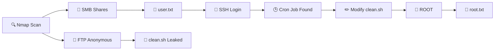

<!-- ═══════════════════════════════════════════════════════════════════ -->
<!--                    ANONYMOUS · TRYHACKME                           -->
<!-- ═══════════════════════════════════════════════════════════════════ -->

<div align="center">

```
█████╗ ███╗   ██╗ ██████╗ ███╗   ██╗██╗   ██╗███╗   ███╗ ██████╗ 
██╔══██╗████╗  ██║██╔═══██╗████╗  ██║╚██╗ ██╔╝████╗ ████║██╔═══██╗
███████║██╔██╗ ██║██║   ██║██╔██╗ ██║ ╚████╔╝ ██╔████╔██║██║   ██║
██╔══██║██║╚██╗██║██║   ██║██║╚██╗██║  ╚██╔╝  ██║╚██╔╝██║██║   ██║
██║  ██║██║ ╚████║╚██████╔╝██║ ╚████║   ██║   ██║ ╚═╝ ██║╚██████╔╝
╚═╝  ╚═╝╚═╝  ╚═══╝ ╚═════╝ ╚═╝  ╚═══╝   ╚═╝   ╚═╝     ╚═╝ ╚═════╝ 
```

### `[ We are Anonymous. We are Legion. We do not forgive. We do not forget. Expect us. ]`


</div>

---

```bash
┌──(root㉿kali)-[~]
└─# whoami
root
┌──(root㉿kali)-[~]
└─# echo "Mission Accomplished ✔"
```

---

## 🎯 Mission Brief

> **Codename:** `ANONYMOUS`
> **Target IP:** `10.146.161.175`
> **Objective:** Capture `user.txt` and `root.txt`
> **Difficulty:** Easy / Medium
> **Class:** Boot2Root · Linux

A Linux box hiding in plain sight. Three doors left open —
**FTP**, **SMB**, and **SSH** — and a silent cron job that never
stops watching. One writable script is all it takes to bring
the whole system down.

---

## 🧠 Skills Unlocked

| 🛠️ Area | 💥 Technique |
|----------|--------------|
| Reconnaissance | `nmap` full port & service scan |
| FTP Abuse | Anonymous login → download files |
| SMB Enumeration | `smbclient` · null session · share listing |
| Credential Reuse | Leaked creds → SSH access |
| Privilege Escalation | Cron job + world-writable script → root shell |

---

## 🗺️ Attack Path



---

## ⚔️ Kill Chain

```diff
+ [01] RECON      →  4 open ports discovered
+ [02] FTP        →  anonymous access granted
+ [03] SMB        →  share "pics" exposed user.txt
+ [04] CREDS      →  reused to log in via SSH
+ [05] PRIVESC    →  /opt/clean.sh writable by all
+ [06] CRON       →  root executes script every minute
+ [07] PAYLOAD    →  reverse shell injected
+ [08] ROOT       →  full system compromise
```

---

## 🧰 Arsenal

```
nmap   ·   ftp   ·   smbclient   ·   enum4linux   ·   nc   ·   ssh
```

---

## 📸 Captured Flags

```bash
user.txt  →  90ddf992585815ff991e68748c414740
root.txt  →  4d930091c31a622a7ed10f27999af363
```

---

## 🖼️ Evidence


---

## 💡 One-Line Takeaway

> Enumerate. Enumerate. Enumerate.
> Then let a silent cron job hand you the keys to the kingdom.

---

<div align="center">

```
╔══════════════════════════════════════════════════════════════╗
║   "The quieter you become, the more you are able to hear."  ║
╚══════════════════════════════════════════════════════════════╝
```

⭐ Star this repo if it helped you level up ⭐

</div>

---

> ⚠️ Disclaimer: This writeup is for educational purposes only.
> All testing was conducted in a controlled lab environment
> (TryHackMe) with full permission.
