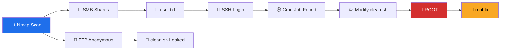

<!-- ═══════════════════════════════════════════════════════════════════ -->
<!--                  A N O N Y M O U S   ·   T H M                     -->
<!-- ═══════════════════════════════════════════════════════════════════ -->

<div align="center">

<h1>🕶️ A N O N Y M O U S 🕶️</h1>

<h3><i>"We are Anonymous. We are Legion.<br>We do not forgive. We do not forget. Expect us."</i></h3>

```
    █████╗ ███╗   ██╗ ██████╗ ███╗   ██╗██╗   ██╗███╗   ███╗ ██████╗ ██╗   ██╗███████╗
   ██╔══██╗████╗  ██║██╔═══██╗████╗  ██║╚██╗ ██╔╝████╗ ████║██╔═══██╗██║   ██║██╔════╝
   ███████║██╔██╗ ██║██║   ██║██╔██╗ ██║ ╚████╔╝ ██╔████╔██║██║   ██║██║   ██║███████╗
   ██╔══██║██║╚██╗██║██║   ██║██║╚██╗██║  ╚██╔╝  ██║╚██╔╝██║██║   ██║██║   ██║╚════██║
   ██║  ██║██║ ╚████║╚██████╔╝██║ ╚████║   ██║   ██║ ╚═╝ ██║╚██████╔╝╚██████╔╝███████║
   ╚═╝  ╚═╝╚═╝  ╚═══╝ ╚═════╝ ╚═╝  ╚═══╝   ╚═╝   ╚═╝     ╚═╝ ╚═════╝  ╚═════╝ ╚══════╝
                          ▓▓▓  HACK THE PLANET  ▓▓▓
```

<p>
  
  
  
  
  
</p>

</div>

---

<div align="center">

```console
┌──(root㉿anonymous)-[~]
└─# whoami
root

┌──(root㉿anonymous)-[~]
└─# id
uid=0(root) gid=0(root) groups=0(root)

┌──(root㉿anonymous)-[~]
└─# echo "Mission Accomplished ✔"
Mission Accomplished ✔
```

</div>

---

## 🎯 Mission Brief

<table align="center">
<tr><td align="right"><b>Codename</b></td><td><code>ANONYMOUS</code></td></tr>
<tr><td align="right"><b>Platform</b></td><td>TryHackMe</td></tr>
<tr><td align="right"><b>Target IP</b></td><td><code>10.146.161.175</code></td></tr>
<tr><td align="right"><b>Objective</b></td><td>Capture <code>user.txt</code> &amp; <code>root.txt</code></td></tr>
<tr><td align="right"><b>Difficulty</b></td><td>Easy / Medium</td></tr>
<tr><td align="right"><b>Class</b></td><td>Boot2Root · Linux</td></tr>
</table>

> *A Linux box hiding in plain sight.*
> Three doors left wide open — **FTP**, **SMB**, and **SSH** —
> and a silent **cron job** that never stops watching.
> One writable script is all it takes to bring the whole system down.

---

## 🧠 Skills Unlocked

| 🛠️ Area                | 💥 Technique                                          |
|------------------------|------------------------------------------------------|
| 🔍 **Reconnaissance**   | `nmap` full port & service scan                      |
| 📂 **FTP Abuse**        | Anonymous login → download sensitive files           |
| 📁 **SMB Enumeration**  | `smbclient` · null session · share listing           |
| 🔑 **Credential Reuse** | Leaked creds → SSH access                            |
| 👑 **Privilege Escalation** | Cron job + world-writable script → reverse shell |

---

## 🗺️ Attack Path



---

## ⚔️ Kill Chain

```diff
+ [01] RECON      →  4 open ports discovered
+ [02] FTP        →  anonymous access granted
+ [03] SMB        →  share "pics" exposed user.txt
+ [04] CREDS      →  reused to log in via SSH
+ [05] PRIVESC    →  /opt/clean.sh writable by all
+ [06] CRON       →  root executes script every minute
+ [07] PAYLOAD    →  reverse shell injected
+ [08] ROOT       →  full system compromise
```

---

## 🧰 Arsenal

<p align="center">
  
  
  
  
  
  
</p>

---

## 🏆 Captured Flags

```bash
╭─────────────────────────────────────────────────────────────╮
│  user.txt  →  90ddf992585815ff991e68748c414740              │
│  root.txt  →  4d930091c31a622a7ed10f27999af363              │
╰─────────────────────────────────────────────────────────────╯
```

---

## 🖼️ Evidence

<div align="center">


<br><br>

<br><br>

<br><br>

<br><br>

<br><br>

<br><br>

<br><br>

<br><br>

<br><br>

<br><br>

<br><br>

<br><br>

<br><br>

<br>

</div>

---

## 💡 One-Line Takeaway

> **Enumerate. Enumerate. Enumerate.**
> Then let a silent cron job hand you the keys to the kingdom.

---

<div align="center">

```
╔══════════════════════════════════════════════════════════════╗
║   "The quieter you become, the more you are able to hear."  ║
║                        — Kali Linux                          ║
╚══════════════════════════════════════════════════════════════╝
```

### ⭐ Star this repo if it helped you level up ⭐

<sub>Made with 🖤 by a fellow hacker</sub>

</div>

---

> ⚠️ **Disclaimer**
> This writeup is for **educational purposes only**.
> All testing was conducted in a controlled lab environment
> (TryHackMe) with full permission.

<!-- ═══════════════════════════════════════════════════════════════════ -->
<!--                          END OF FILE                                -->
<!-- ═══════════════════════════════════════════════════════════════════ -->
